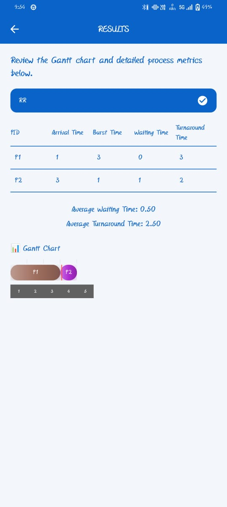

## 🧠 CPU Scheduler Simulator

A cross-platform Flutter application that simulates classic CPU scheduling algorithms with interactive visual Gantt charts, context switching detection, and detailed performance metrics. Designed for students, educators, and systems enthusiasts to understand how different scheduling algorithms affect CPU utilization and process management.


---

## 🎯 Overview

This simulator implements **6 major CPU scheduling algorithms** and visualizes their behavior in real-time. Users input process details (PID, Arrival Time, Burst Time, Priority) and instantly see:
- Gantt charts with time markers
- Context switching points (highlighted with red indicators)
- Per-process waiting time and turnaround time
- Average metrics across all processes

**Perfect for:**
- Operating Systems courses
- Algorithm analysis and comparison
- Interview preparation
- Understanding scheduling trade-offs


## 🚀 Features

| Feature | Details |
|---------|---------|
| **📊 Gantt Chart Visualization** | Interactive timeline with execution blocks, time markers, and color-coded processes |
| **🔄 Context Switch Detection** | Red indicators show CPU context switches between processes |
| **🧮 Performance Metrics** | Per-process and system-wide waiting time & turnaround time calculations |
| **🎨 Algorithm Support** | FCFS, SJF, Round Robin, Priority Scheduling (with extensible architecture) |
| **📤 Export Result as PDF** | Can Download the Result in the Storage. |
| **📱 Cross-Platform** | Runs on Android, iOS, Windows, macOS, Linux, Web |
| **💾 Dynamic Input** | Support for variable number of processes with real-time form validation |

---


### Supported Algorithms

1. **FCFS** (First Come, First Serve)
   - Non-preemptive
   - Processes execute in arrival order

2. **SJF** (Shortest Job First)
   - Non-preemptive
   - Processes with shortest burst time execute first

3. **RR** (Round Robin)
   - Preemptive
   - Configurable time quantum
   - Fair CPU allocation

4. **PS** (Priority Scheduling)
   - Non-preemptive
   - Lower priority number = higher priority
   - Customizable for each process

5. **SRTF** (Shortest Remaining Time First)
   - Preemptive version of SJF
   - Switches to process with shortest remaining burst time
   - Minimizes average waiting time (optimal preemptive algorithm)

6. **MLQ** (Multilevel Queue Scheduling)
   - Multiple priority queues (Foreground: RR, Background: FCFS)
   - Processes in higher priority queue execute first
   - Lower priority queues only run when upper queues empty
---


## 📸 Screenshots

| Algorithm Selection | Process Form Entry | Results & Gantt Chart |
|:-------------------:|:------------------:|:--------------------:|
| Choose from 4 algorithms | Input process details | View metrics & timeline |
|  |  |  |

---

## 🛠️ Tech Stack

| Component | Technology |
|-----------|------------|
| **Framework** | Flutter (v1.0.0+) |
| **Language** | Dart (SDK ^3.9.2) |
| **UI Library** | Material Design 3 |
| **Architecture** | Stateful widgets + Page-based navigation |
| **Data Handling** | Form validation, in-memory state management |

### Core Dependencies
- `cupertino_icons` ^1.0.8 - iOS-style icons
- `flutter_launcher_icons` ^0.14.4 - App icon generation
- `flutter_lints` ^6.0.0 - Code quality analysis

---


## 📂 Project Structure

```
lib/
├── main.dart                      # App entry point & MaterialApp config
├── starting_page.dart             # Landing page with navigation
├── ChooseAlgorithmPage.dart       # Algorithm selection UI (FCFS, SJF, RR, PS)
├── process_form_page.dart         # Dynamic form for process input
├── results_page.dart              # Results display & metrics calculation
├── info_page.dart                 # Algorithm explanation & info
└── gantt_chart.dart               # Gantt chart rendering & visualization

android/, ios/, windows/, linux/, macos/, web/
└── Platform-specific build files & configurations
```
---

### File Responsibilities

| File | Purpose |
|------|---------|
| `main.dart` | App initialization, MaterialApp configuration, theme setup |
| `starting_page.dart` | Landing page with "Start Simulation" navigation |
| `ChooseAlgorithmPage.dart` | Algorithm selection with full names and short codes (FCFS, SRTF, MLQ SJF, RR, PS) |
| `process_form_page.dart` | Dynamic form generation for process input; supports priority field for PS and quantum field for RR |
| `results_page.dart` | Display simulation results, calculate per-process metrics, show averages |
| `info_page.dart` | Algorithm description and explanation page |
| `gantt_chart.dart` | Render visual Gantt chart with process blocks, time markers, and context switch indicators |

---

## 💻 How It Works

### User Flow
1. **Launch App** → `starting_page.dart` landing page
2. **Select Algorithm** → `ChooseAlgorithmPage.dart` (FCFS, SJF, RR, or PS)
3. **View Info** → `info_page.dart` shows algorithm details
4. **Enter Processes** → `process_form_page.dart` (PID, Arrival Time, Burst Time, Priority/Quantum)
5. **Run Simulation** → Calculate scheduling via algorithm logic
6. **View Results** → `results_page.dart` + `gantt_chart.dart`
   - Gantt chart with time markers
   - Per-process metrics (Waiting Time, Turnaround Time)
   - System averages
   - Context switch indicators

### Metrics Calculated

- **Waiting Time (WT)** = Turnaround Time − Burst Time
- **Turnaround Time (TAT)** = Completion Time − Arrival Time
- **Average WT** = Sum of all WT / Number of Processes
- **Average TAT** = Sum of all TAT / Number of Processes
- **Context Switches** = Count of CPU transitions between processes

### Algorithm Implementations

#### FCFS (First Come, First Served)
```
Process execution in order of arrival
No preemption; process runs to completion
```

#### SJF (Shortest Job First)
```
From ready processes, select shortest burst time
Non-preemptive; process runs to completion
```

#### RR (Round Robin)
```
Each process gets fixed time quantum
If burst > quantum, process goes to back of queue
Preemptive; switches occur at quantum expiry
```

#### PS (Priority Scheduling)
```
Lower priority number = higher priority
Execute highest priority ready process
Non-preemptive; process runs to completion
```

#### SRTF (Shortest Remaining Time First)
```
Preemptive version of SJF
Always execute process with shortest remaining burst time
When new process arrives, check if remaining time < current
If yes, switch to new process (preempt); if no, continue
```

#### MLQ (Multilevel Queue Scheduling)
```
Maintain multiple priority queues (Foreground: RR, Background: FCFS)
Foreground queue uses Round Robin with time quantum
Background queue uses FCFS
Execute all Foreground processes before Background processes
Prevent starvation with aging or priority boost mechanisms
```

---
## 🔧 Installation & Setup

### Prerequisites
- Flutter SDK (≥ 3.9.2)
- Dart SDK (included with Flutter)
- Git

### Steps

1. **Clone the repository**
   ```bash
   git clone https://github.com/Biswajeet111/cpu-scheduler-simulator.git
   cd cpu-scheduler-simulator
   ```

2. **Install dependencies**
   ```bash
   flutter pub get
   ```

3. **Run on your target platform**
   ```bash
   # Android
   flutter run -d android

   # iOS
   flutter run -d ios

   # Windows
   flutter run -d windows

   # macOS
   flutter run -d macos

   # Linux
   flutter run -d linux

   # Web
   flutter run -d chrome
   ```

4. **Build Release APK** (Android example)
   ```bash
   flutter build apk --release
   ```

---


## 🧪 Development

### Code Quality
```bash
# Analyze code for issues
flutter analyze

# Format code to style guidelines
dart format lib/

# Run widget tests
flutter test
```

### Making Changes

**To modify algorithm logic:**
- Edit scheduling calculations in `process_form_page.dart` where algorithm execution happens

**To change UI:**
- Edit pages in `lib/` (e.g., `ChooseAlgorithmPage.dart`, `results_page.dart`)

**To improve Gantt chart:**
- Modify rendering logic in `gantt_chart.dart` (block width, colors, layout)

---

## 📊 Detailed Algorithm Breakdown

### FCFS (First Come, First Served)
- **Preemption:** No
- **Starvation:** No (but convoy effect possible)
- **Pros:** Simple, fair (FIFO order)
- **Cons:** High average waiting time, poor interactive performance
- **Use Case:** Batch systems, legacy systems

**Example:**
```
Process:  P1(BT=8)  P2(BT=4)  P3(BT=2)
Gantt:    [P1---][P2--][P3-]
Avg WT:   0 + 8 + 12 = 20/3 ≈ 6.67
```

### SJF (Shortest Job First)
- **Preemption:** No
- **Starvation:** Yes (long jobs can starve)
- **Pros:** Minimizes average waiting time (optimal non-preemptive)
- **Cons:** Requires burst time prediction, starvation risk
- **Use Case:** Batch systems with known job durations

**Example:**
```
Process:  P1(BT=8)  P2(BT=4)  P3(BT=2)
Gantt:    [P3-][P2--][P1---]
Avg WT:   0 + 2 + 6 = 8/3 ≈ 2.67
```

### RR (Round Robin)
- **Preemption:** Yes
- **Starvation:** No
- **Pros:** Fair, responsive, good for time-sharing
- **Cons:** High context switching overhead, worse than SJF for average wait
- **Use Case:** Interactive systems, OS schedulers

**Example (Quantum=4):**
```
Process:  P1(BT=8)  P2(BT=4)  P3(BT=2)
Gantt:    [P1][P2][P3][P1][P2][P1]
Avg WT:   Various (depends on quantum)
```

### PS (Priority Scheduling)
- **Preemption:** No (can be preemptive variant)
- **Starvation:** Yes (low priority starves)
- **Pros:** Supports critical process prioritization
- **Cons:** Starvation of low-priority processes
- **Use Case:** Real-time systems, multimedia

**Example (Lower # = Higher Priority):**
```
Process:  P1(BT=8, Pr=3)  P2(BT=4, Pr=1)  P3(BT=2, Pr=2)
Gantt:    [P2--][P3-][P1---]
Avg WT:   0 + 4 + 6 = 10/3 ≈ 3.33
```

### SRTF (Shortest Remaining Time First)
- **Preemption:** Yes (preempts for shorter jobs)
- **Starvation:** Yes (long jobs can starve)
- **Pros:** Minimizes average waiting time (optimal preemptive algorithm)
- **Cons:** High context switching overhead, starvation risk, requires burst time knowledge
- **Use Case:** Batch systems with time-sharing, preemptive environments

**Example:**
```
Process:  P1(BT=8)  P2(BT=4, arrives at T=1)  P3(BT=2, arrives at T=2)
Timeline:
T=0: P1 starts (remaining=8)
T=1: P2 arrives (BT=4 < P1 remaining=7) → PREEMPT to P2
T=2: P3 arrives (BT=2 < P2 remaining=3) → PREEMPT to P3
T=4: P3 completes, P2 resumes (remaining=1)
T=5: P2 completes, P1 resumes (remaining=7)
T=12: P1 completes
Gantt:    [P1-][P2--][P3-][P2-][P1-----]
Avg WT:   Better than SJF due to preemption
```

### MLQ (Multilevel Queue Scheduling)
- **Preemption:** Yes (Foreground RR) / No (Background FCFS)
- **Starvation:** Yes (background processes can starve)
- **Pros:** Flexible, supports different process types, high priority responsiveness
- **Cons:** Complexity, potential starvation of lower queues
- **Use Case:** General-purpose OS (interactive foreground + batch background)

**Example (Foreground RR with Quantum=2, Background FCFS):**
```
Foreground Queue: P1(BT=3)  P2(BT=5)
Background Queue: P3(BT=4)  P4(BT=6)

Priority: Foreground >> Background

Execution Timeline:
T=0-2: P1 (quantum expires, enqueue back)
T=2-4: P2 (quantum expires, enqueue back)
T=4-6: P1 completes (remaining=1)
T=6-8: P2 (quantum expires, enqueue back)
T=8-10: P2 completes (remaining=1)
(Foreground empty, now execute Background)
T=10-14: P3 completes (FCFS)
T=14-20: P4 completes (FCFS)

Gantt:    [P1][P2][P1][P2][P3---][P4------]
Note: Background processes P3, P4 only run after Foreground queues empty
```


## 📦 Dependencies & Versions

| Package | Version | Purpose |
|---------|---------|---------|
| `flutter` | Latest | UI framework |
| `cupertino_icons` | ^1.0.8 | iOS-style icons |
| `flutter_launcher_icons` | ^0.14.4 | Icon generation & deployment |
| `flutter_lints` | ^6.0.0 | Dart linting rules |
| `flutter_test` | (SDK) | Widget & unit testing |
| `Dart SDK` | ^3.9.2 | Language & runtime |

All dependencies are in `pubspec.yaml`. Run `flutter pub get` to install.

---


## 🚀 Future Enhancements

- [ ] **Multilevel Feedback Queue** - Dynamic priority adjustment
- [ ] **Comparison Mode** - Run multiple algorithms side-by-side
- [ ] **Animated Transitions** - Smooth process execution animations
- [ ] **Dark Mode** - Theme toggle support
- [ ] **Persistent Storage** - Save & load simulation history
- [ ] **Advanced Metrics** - CPU utilization, throughput analysis
- [ ] **Mobile Optimization** - Responsive design improvements
- [ ] **Accessibility** - Screen reader support, keyboard navigation

---

**Biswajeet Kumar**  
B.Tech Computer Science & Engineering  
Lovely Professional University (LPU)

### Connect
- **GitHub:** [@Biswajeet111](https://github.com/Biswajeet111)
- **LinkedIn:** [https://www.linkedin.com/in/biswajeet-kumar-a70043362?utm_source=share&utm_campaign=share_via&utm_content=profile&utm_medium=android_app]
- **Email:** [biswajeetk497@gmail.com]

---

**Yash Raj**  
B.Tech Computer Science & Engineering  
Lovely Professional University (LPU)

### Connect
- **GitHub:** [@212myash](https://github.com/212myash)
- **LinkedIn:** [https://www.linkedin.com/in/modi-yash-raj-9602a8271/]
- **Email:** [212myashraj@gamil.com]

Passionate about systems engineering, algorithm optimization, and building educational tools.
---

## 🙏 Acknowledgments

- **Flutter Team** - Exceptional framework and documentation
- **Dart Language** - Clean, productive language
- **Operating Systems Textbooks** - Classic algorithm references (Silberschatz, Stallings, Tanenbaum)

---

## ❓ FAQ

**Q: How many processes can I simulate?**  
A: The form supports dynamic input. Performance typically smooth with 50+ processes; limit depends on device.

**Q: What's the difference between SJF and SRTF?**  
A: SJF is non-preemptive (process runs to completion). SRTF is preemptive (switches to shorter job if it arrives). SRTF minimizes avg waiting time further.

**Q: Can I save my simulation results?**  
A: Currently, results are in-memory. Future version will add persistent storage via `process_list.json`.

**Q: How do I add a new algorithm?**  
A: Modify `process_form_page.dart` to add algorithm selection, then implement the scheduling logic in the calculation section.

**Q: Does it work offline?**  
A: Yes! The app is fully offline. No internet required.

**Q: Can I modify burst time or arrival time after entering?**  
A: Yes, edit fields before clicking "Simulate". After simulation, create a new simulation with different values.

---

## 🐛 Bug Reports & Issues

Found a bug? Have a suggestion? [Open an issue](https://github.com/Biswajeet111/cpu-scheduler-simulator/issues) with:
- Clear description
- Steps to reproduce
- Expected vs. actual behavior
- Device/OS info

---

## 📞 Support

For questions or help:
1. Check the **FAQ** section above
2. Review [algorithm explanation](#-detailed-algorithm-breakdown)
3. Check existing [GitHub Issues](https://github.com/Biswajeet111/cpu-scheduler-simulator/issues)
4. Open a new issue with details

---

**Made with ❤️ for students learning Operating Systems & CPU Scheduling**


---

## 🤝 Contributing

Contributions are welcome! To contribute:

1. **Fork** the repository
2. **Create** a feature branch (`git checkout -b feature/your-feature`)
3. **Commit** your changes (`git commit -m 'Add your feature'`)
4. **Push** to branch (`git push origin feature/your-feature`)
5. **Open** a Pull Request with description

### Code Guidelines
- Follow Dart [style guide](https://dart.dev/guides/language/effective-dart/style)
- Add comments for complex logic
- Test changes with `flutter test`
- Ensure `flutter analyze` passes

---
