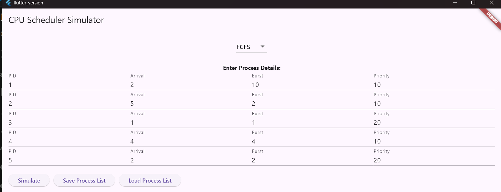
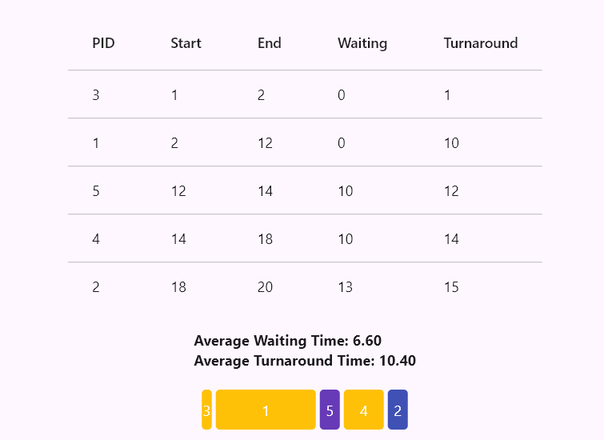

## 🧠 CPU Scheduler Simulator

A cross-platform Flutter app that simulates classic CPU scheduling algorithms with visual Gantt charts, context switching indicators, and performance metrics. Built for students, educators, and systems enthusiasts.



---

## 🚀 Features

- 📊 Gantt chart visualization with time markers
- 🔄 Context switching row to show CPU transitions
- 🧮 Average waiting time & turnaround time calculations
- 💾 Save & load process lists (`process_list.json`)
- 🧠 Algorithms supported:
  - FCFS (First-Come, First-Served)
  - SJF (Shortest Job First)
  - SRTF (Shortest Remaining Time First)
  - Round Robin (RR)
  - Priority Scheduling
  - Multilevel Queue Scheduling

---

## 🧠 Algorithms Explained

- **FCFS**: Executes processes in the order they arrive.
- **SJF**: Picks the process with the shortest burst time.
- **SRTF**: Preemptive version of SJF; switches if a shorter job arrives.
- **RR**: Time-sliced execution with a fixed quantum.
- **Priority**: Executes based on priority value (lower = higher priority).
- **Multilevel Queue**: Foreground (RR) + Background (FCFS) queues.

---

 ## 📸 Screenshots

| Execution Timeline | Result / Gantt Chart |
|--------------------|----------------------|
|  |  |

*(Add a context switch screenshot in `images/` if you want the third column shown.)*

---

## 🛠️ Technologies

- Flutter & Dart
- Local file I/O (`dart:io`)
- Form validation (`Form`, `TextFormField`)
- Custom widgets and modular architecture

---

## 💻 Folder Structure (high level)

lib/
- main.dart
- scheduler_home.dart        # UI and main logic
- scheduler_algorithm.dart   # Scheduling algorithm implementations
- gantt_chart_widget.dart    # Gantt chart renderer

Other platform folders: `android/`, `ios/`, `macos/`, `windows/`, `linux/`, `web/`.

---

## ⚙️ How It Works

1. Select an algorithm from the dropdown.
2. Enter processes (PID, Arrival Time, Burst Time, Priority if applicable).
3. Click "Simulate".
4. View results:
   - Gantt chart with time markers
   - Context switch indicators
   - Average waiting time & turnaround time

Notes:
- The app currently supports up to 5 concurrent processes via the UI input form.

---

## 📥 Installation

Make sure you have Flutter installed. Then run:

```bash
git clone https://github.com/Biswajeet111/cpu-scheduler-simulator.git
cd cpu-scheduler-simulator
flutter pub get
flutter run
```

If you're running on Windows and targeting Windows desktop, use `flutter run -d windows`.

---

## 🧪 Development & Testing

- Edit UI in `lib/scheduler_home.dart`.
- Modify or add algorithms in `lib/scheduler_algorithm.dart`.
- Renderer logic in `lib/gantt_chart_widget.dart`.

To run the included widget test:

```bash
flutter test
```

---

## 📦 Dependencies

- flutter_launcher_icons
- cupertino_icons
- flutter_lints

Check `pubspec.yaml` for exact versions.

---

## 🚀 Future Improvements

- Export results to CSV or PDF
- Add more preemptive algorithms and configurable time quantum for RR
- Improve accessibility and mobile responsiveness

---

## 🙋‍♂️ Author

Biswajeet Kumar
B.Tech CSE @ Lovely Professional University

---

## ✅ Save, Commit, and Push

After editing, run:

```bash
git add README.md
git commit -m "Polish README: split into clear sections"
git push
```

---

## 🤝 Contributing

Pull requests are welcome! If you'd like to add a new algorithm, improve UI, or fix bugs:
- Fork the repo
- Create a feature branch
- Submit a pull request with a clear description

Please follow the existing code style and comment your logic.

## 📜 License

This project is licensed under the MIT License. See the [LICENSE](LICENSE) file for details.